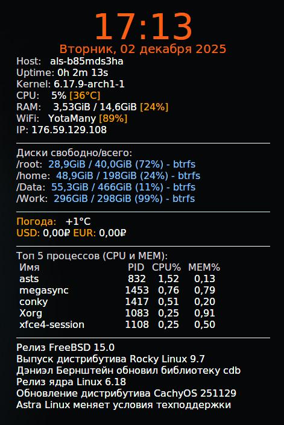

<p align="left">
  
</p>

## Conky Config 📋💻

Этот конфигурационный файл позволяет создать стильный и функциональный виджет мониторинга системы на рабочем столе Linux.

### Зависимости:

```ini
curl для передачи данных
jq для обработки json
lm_sensors для снятия температур (пример пакета для archlinux, в разных дистрах названия разнятся)
```

<details>
<summary>Пример настройки сенсоров для archlinux</summary>

#### Обнови систему

sudo pacman -Syu

#### Установи пакеты

sudo pacman -S lm_sensors conky

#### Настрой датчики (мастер — отвечай yes по умолчанию, это безопасно)

sudo sensors-detect --auto # Авто-режим для простоты

#### Включи сервис (автозагрузка модулей)

sudo systemctl enable --now lm_sensors

#### Проверь вывод (ищи coretemp для Intel: Core 0: +45.0°C)

sensors

#### Пример использования lm_sensors

ls /sys/class/hwmon/

cat /sys/class/hwmon/hwmon0/name пример для просмотра какой датчик будет отображаться

#### Ниже итоговая строка для конфига коньков, значение hwmon зависит от опрашиваемого устройства

${color1}CPU:    ${color2}${cpu cpu0}% ${color3}[${hwmon 0 temp 1}°C]

</details>

### Основные возможности:

- Большие часы с указанием текущего времени и даты, отображаемые в центре экрана.
- Подробная статистика использования ресурсов ПК:
  - Нагрузка процессора (CPU).
  - Загруженность оперативной памяти (RAM).
  - Температура CPU.
  - Информацию о беспроводном соединении Wi-Fi и IP-адресе.
- Полезные блоки для мониторинга состояния жестких дисков:
  - Доступное пространство на каждом разделе диска.
  - Тип файловой системы каждого раздела.
- Актуальная погода для выбранного города.
- Текущие курсы основных валют (доллар, евро).
  (Курс валют парсится с сайта ЦБ РФ, периодически есть проблема с отдачей данных, смена источника не помогла, оставил как есть)
- Список пяти наиболее ресурсоемких процессов, сортируемых по нагрузке на процессор и память.
- Обновляемый блок с заголовками новостей ИТ-тематики.
  (Заголовки фильтруются для показа по ширине окна conky, поэтому обновляются не часто)

### Особенности конфигурации:

- Возможность автоматического обновления показаний.
- Оформление с настраиваемыми цветами и шрифтами.
- Совместимость с различными дистрибутивами Linux.
- Минималистичный дизайн.

---

#### Установка и использование:

Скопируйте этот конфиг в домашний каталог:

```bash
`/home/$USER/.config/conky/conky.conf`
```

Затем запустите Conky следующим образом:

```bash
conky &
```

При желании включите автоматический запуск конфига при каждой загрузке системы, следуя инструкциям ниже.

---

### ⚙️ Настройка Автозагрузки

Создайте файл autostart:

```bash
mkdir -p ~/.config/autostart && nano ~/.config/autostart/conky.desktop
```

Добавьте следующую запись:

```ini
[Desktop Entry]
Type=Application
Name=Conky
Exec=/usr/bin/conky
Comment=Запуск Conky
NoDisplay=false
X-GNOME-Autostart-enabled=true
Hidden=false
Terminal=false
```

Сохраните изменения и перезагрузитесь для проверки.

---

### Файлы

- `/home/$USER/.config/conky/conky.conf`: основной конфигурационный файл.
- `~/.config/autostart/conky.desktop`: настройка автозапуска.

---

### Смотрите также

- `man conky`: документация по программе Conky.
